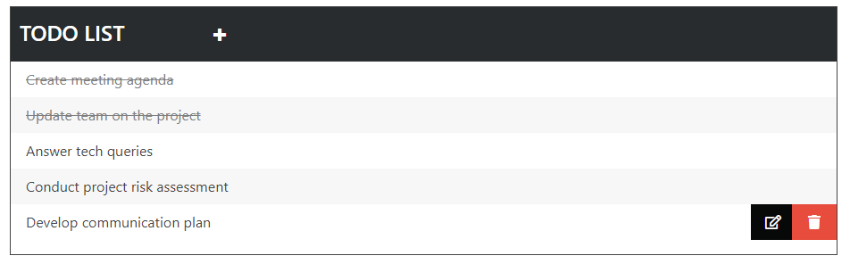

# TodoList-webapp
A todo list webapp using JQuery.

### Usage
* Click on item to mark it done.
* Click on the delete icon to delete the item permanently.
* Click on the edit icon to edit an item.
* Use the add sign to add item.

